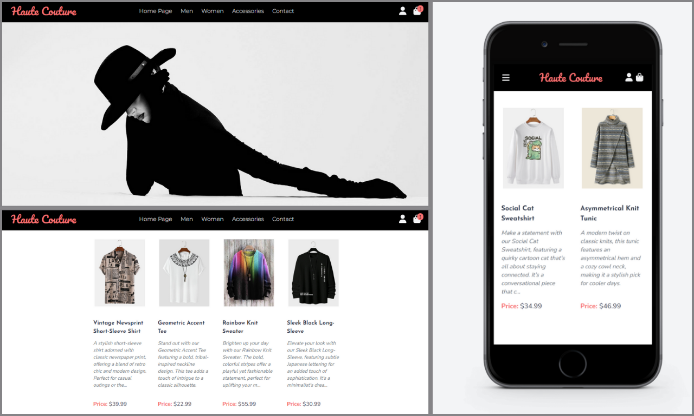

# Haute Couture - A Virtual Fashion Experience

Welcome to Haute Couture, a React-based mock clothing store that brings together the elegance of fashion and the sophistication of modern web technology. This project is designed to simulate a real-world e-commerce clothing store, providing a fully responsive user interface with two distinct menu designs for different screen sizes.

## Features

- **React and Redux**: Utilizes React for dynamic user interfaces and Redux for efficient state management across the application, particularly for the shopping bag feature.
- **Responsive Design**: Fully responsive design ensures a seamless shopping experience across various devices. Features two different menus optimized for both mobile and desktop views.
- **Tailwind CSS & Custom Styling**: Styled with the utility-first CSS framework Tailwind, along with custom CSS for unique design elements.
- **Interactive Shopping Experience**: Users can browse products, view best sellers, and manage their selections in a simulated shopping bag.
- **React Router**: Implements React Router for smooth navigation throughout the store's various pages.
- **Firebase Integration**: Uses Firebase for storing product details, user information, and order history. Includes features for user authentication and order processing.
- **React Form Library**: Incorporates a React form library for efficient and user-friendly form handling, enhancing the overall user experience.

## Technologies Used

- React.js
- Redux
- Tailwind CSS
- JavaScript
- HTML
- Custom CSS
- Firebase
- React Form Library